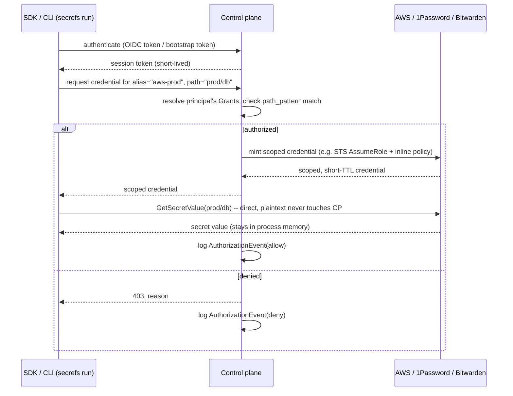

# The SecRefs control plane

**Status:** Proposed — not yet built. Nothing in this doc exists in code yet.
**Author:** drafted by Claude with Nathan, 2026-08-30.

## 1. Why

Today an org authenticates to its own vault (AWS, Vault) purely via ambient
credentials — an IAM role, `VAULT_ADDR`/`VAULT_TOKEN` already in the
environment. That's real BYOV, and it works, but it has no admin surface:

- No place for an org to **onboard a vault** (hand SecRefs the API
  token/service account for 1Password, Bitwarden, or an AWS role to assume)
  other than "set an env var on every machine that runs `secrefs`."
- No **RBAC** — anyone who can reach the ambient credential can resolve
  *any* `sec://` reference that credential's scope allows. There's no way
  to say "the `ci-deploy` role can expand `sec://aws-prod/db/*` but not
  `sec://aws-prod/billing/*`."
- No **audit trail** of who/what resolved which reference, when.

The control plane is the piece that closes those three gaps: an org
connects its vaults once, defines roles, and every `sec://` expansion after
that is authorized and logged — without becoming a place secret *values*
routinely pass through in plaintext.

## 2. Goals / non-goals

**Goals**
- Org-level vault connection management (AWS Secrets Manager, 1Password,
  Bitwarden Secrets Manager for v1 — see [§8](#8-per-backend-integration)).
- RBAC: roles bind to principals (humans and services) and grant scoped
  access to specific connections/path patterns.
- Audit log of every authorization decision.
- Stay compatible with today's pure-ambient-credential mode — a team with
  no control plane account keeps working exactly as it does now.

**Non-goals (v1)**
- The control plane is **not** a secret store. It never holds a copy of an
  actual secret *value* — see the trust-model decision below.
- Not building a general-purpose secrets-manager UI (browsing/editing
  secret contents). Vaults stay the system of record for secret data;
  SecRefs only manages *access* to them.
- Not covering `sec://local` — that's dev-only and stays file-based.

## 3. The central trust-model decision

Two shapes a "control plane" could take, and they have very different
implications for the README's existing pledge ("No plaintext secret is
ever written to disk or sent to a third-party SaaS vault"):

| | **Credential broker** (recommended) | **Secret proxy** |
|---|---|---|
| What it returns | A short-lived, narrowly-scoped credential *for the underlying vault* | The resolved secret *value* itself |
| Who talks to the vault | The SDK, directly, using the minted credential | The control plane, on the SDK's behalf |
| Does plaintext ever transit SecRefs infra | No | Yes (in memory, in transit) |
| README's "no third-party SaaS vault" claim | Still true — SecRefs becomes an *authorization* layer, not a secret custodian | Now false as written — needs rewording |
| Precedent | Vault's own dynamic secrets/leases; AWS STS `AssumeRole` | Doppler, Infisical, Akeyless-style SaaS |

**Recommendation: build the credential broker.** It's more work per backend
(§8), but it's the only shape that keeps the BYOV pledge honest, and all
three v1 backends support scoped, delegatable credentials cleanly enough to
make it practical (confirmed per-backend in §8 — this isn't a "hope AWS
adds a feature" bet).

If a future backend genuinely can't support delegation, the honest move is
a clearly-labeled opt-in "proxy mode" for that backend specifically, not
quietly weakening the guarantee for everyone.

## 4. Master credential custody

Separately: where does the org's *master* vault credential — the AWS role
ARN, the 1Password Connect token, the Bitwarden access token — live once
the org hands it to SecRefs?

- **v1 — KMS-encrypted at rest.** Envelope-encrypted per org (a data key
  per org, wrapped by a control-plane KMS key), decryptable only by the
  control-plane service's own runtime role. Never returned by any read API,
  including to the org's own admins — rotation is "paste a new one in,"
  never "read the old one back out." This is the same custody model
  Doppler/Infisical/Akeyless use in production; it's well-understood and
  fast to ship.
- **v2 (later, optional) — self-hosted connector.** A small agent the org
  runs inside their own infra (mirrors how 1Password's own Connect server
  already works) that holds the real master token; the control plane talks
  *only* to the connector, never sees the master token at all. Strictly
  stronger trust model, meaningfully more ops burden for the org.

Model `VaultConnection` (§5) so a connection is either
`{ encrypted_credential }` or `{ connector_url }` — v2 is additive, not a
migration.

## 5. Data model

```
Organization
  id, name, created_at

User                                    ServiceIdentity
  id, org_id, email, idp_subject          id, org_id, name
                                           auth_mode: oidc_federated | bootstrap_token
                                           (e.g. "github-actions:repo:acme/api:ref:main")

VaultConnection
  id, org_id, provider ("aws" | "1password" | "bitwarden")
  alias                    -- maps to sec://<alias>/... used in code
  credential_ref            -- { encrypted_credential } | { connector_url }, see §4
  created_by, created_at, last_rotated_at

Role
  id, org_id, name          -- e.g. "backend-prod", "ci-deploy"

RoleBinding
  role_id, principal_id     -- principal_id -> User or ServiceIdentity

Grant
  role_id, vault_connection_id
  path_pattern               -- glob/prefix, e.g. "prod/db/*"
  field_pattern (optional)   -- restrict to specific #field(s)
  max_ttl                    -- upper bound on minted credential lifetime

AuthorizationEvent (audit log)
  id, org_id, principal_id, vault_connection_id, path, decision (allow|deny)
  requested_at, source_ip, ci_run_id (optional)
  -- never the secret value; never even the field name in a value-shaped way
```

`alias` is the load-bearing link back to today's code: `sec://aws-prod/db#password`
resolves `aws-prod` to a `VaultConnection`, then checks the caller's `Grant`s
against `db` before minting anything.

## 6. RBAC in practice

```
Role "ci-deploy"
  Grant: connection=aws-prod, path=prod/db/*,      max_ttl=15m
  Grant: connection=aws-prod, path=prod/api-key,   max_ttl=15m

Role "backend-oncall"
  Grant: connection=aws-prod, path=prod/*,         max_ttl=1h
  Grant: connection=vault-eu, path=secret/data/*,  max_ttl=1h
```

A principal with no matching `Grant` for a requested `alias`/`path` gets a
clean `403`-shaped denial from the control plane — same failure shape the
SDK already has for "unknown provider" today, just sourced from policy
instead of a missing registry entry.

## 7. Runtime protocol



Per `secrefs run` invocation: **one** authenticate + one credential mint
per distinct `(alias, connection)` pair actually referenced (not per
`sec://` reference) — a `.env` with five `sec://aws-prod/...` refs across
different paths still only needs one scoped-enough AWS credential if the
Grant's `path_pattern` already covers all five; SDK requests the widest
credential its Grants allow, then resolves every matching reference with
it. Cached for the process lifetime.

Falls back to today's pure-ambient mode automatically when
`SECREFS_CONTROL_PLANE_URL` (or equivalent) isn't set — a `VaultConnection`
never becomes a hard requirement for a provider that's happy reading
`VAULT_ADDR`/`VAULT_TOKEN` or the default AWS credential chain itself.

## 8. Per-backend integration

| Backend | Master credential org provides | Scoped credential control plane mints | Notes |
|---|---|---|---|
| **AWS Secrets Manager** | ARN of an IAM role SecRefs' control-plane account may assume (`sts:AssumeRole`, trust policy scoped to us) | Temporary STS credentials via `AssumeRole` + an inline session policy restricting `secretsmanager:GetSecretValue` to the matching secret ARN(s), `DurationSeconds` = `Grant.max_ttl` | Cleanest fit — STS session policies do real per-request scoping. No long-lived AWS keys ever stored. |
| **1Password** | A [Connect](https://developer.1password.com/docs/connect/) server URL + a bootstrap access token | A vault-scoped Connect token (1Password lets you mint tokens scoped to specific vaults at creation time) matching the Grant's vaults, short TTL | Scoping granularity is per-*vault*, not per-item — `path_pattern` maps to which 1Password vault(s) a Grant covers, item-level filtering happens SDK-side against what that vault-scoped token can see. |
| **Bitwarden** | A Bitwarden **Secrets Manager** (not the password vault) machine-account access token, scoped to a project | A narrower project-scoped access token if the Grant covers a subset of that project's secrets, else the same token re-issued with a short TTL | Bitwarden Secrets Manager's access-token model is project-scoped; sub-project (path-level) scoping is enforced SDK-side, same shape as 1Password. |

`packages/node/src/providers/*` and `packages/python/secrefs/providers/*`
each need a `credentialSource` in front of the existing constructor logic:
either "ambient" (today's behavior, unchanged) or "control-plane" (call a
new thin `ControlPlaneClient`, get back a credential, construct the same
underlying vault SDK client with it). The `fetchOne`/`healthCheck` methods
on `AwsSecretsManagerProvider`/`VaultProvider` don't need to change at all.

## 9. Control-plane auth

- **Humans** (org admins managing connections/roles via a console):
  SSO/OIDC login, standard session cookies.
- **Machines** (CI runners, prod services calling `secrefs run`):
  prefer **workload identity federation** — GitHub Actions' and GitLab
  CI's built-in OIDC issuers, Kubernetes service account tokens — so there
  is no static, long-lived credential to leak in the first place. Where a
  platform has no OIDC issuer (bare EC2, on-prem), fall back to a
  **bootstrap token**: narrowly scoped to *requesting credentials for its
  bound roles only* (never a master vault token itself), rotatable,
  revocable independently of everything else. Compromising a bootstrap
  token costs you exactly what its `Role` grants — not the org's AWS role
  or 1Password vault outright.

## 10. Proposed repo layout (not yet created)

```
apps/control-plane/          -- API + admin console (Next.js API routes or a
                                 separate service; TBD when we scaffold)
packages/control-plane-client/  -- thin client the Node/Python SDKs call;
                                    or fold directly into packages/node,
                                    packages/python as an internal module
```

Left open deliberately — this is a scaffolding-time decision, not a
design-doc one.

## 11. Phased rollout

- **v1:** AWS Secrets Manager only. KMS-encrypted connection storage.
  RBAC + audit log. Workload-identity auth for CI, bootstrap token
  fallback. No admin UI yet — API + CLI (`secrefs connect`, `secrefs grant`)
  is enough to prove the model.
- **v2:** 1Password + Bitwarden connections. Admin console (the piece that
  actually needs a UI — connection setup, role management, audit view).
- **v3:** Self-hosted connector option (§4) for orgs that want the master
  token to never leave their infra at all.

## 12. Open questions for Nathan

1. Does `apps/control-plane` live in *this* monorepo, or is it a separate
   service/repo entirely? (Affects deploy topology, not the design above.)
2. Pricing/tiering shape — is RBAC + audit a paid tier, gating the free
   BYOV-ambient mode as-is today? Doesn't affect the technical design but
   affects what "v1 done" means.
3. Confirm the credential-broker decision in §3 — this is the one call in
   this doc that changes what the README can honestly claim, so it's worth
   an explicit yes before anything gets built on top of it.
